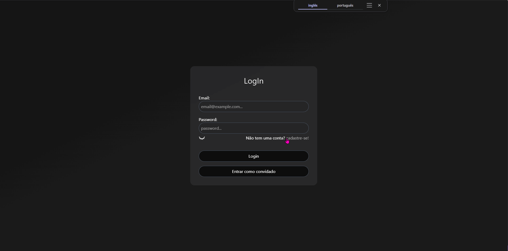

# DevFeed 🚀

Bem-vindo ao **DevFeed**! Uma aplicação web moderna e dinâmica de feed social construída com React, Zustand e Tailwind CSS. Este projeto foi desenvolvido para demonstrar habilidades em desenvolvimento front-end, incluindo gerenciamento de estado global, autenticação de usuário, interações em tempo real e componentização modular.

### ✨ Demonstração Visual



---

## 📋 Funcionalidades Principais

- **Autenticação Completa:** Sistema de Cadastro, Login e modo Convidado. A sessão do usuário é persistida no `localStorage`.
- **Gerenciamento de Posts (CRUD):** Usuários autenticados podem Criar, Ler, Atualizar e Deletar seus próprios posts.
- **Sistema de Permissões:** Administradores podem deletar qualquer post, enquanto usuários só podem gerenciar o que é seu.
- **Interatividade Social:** Sistema de Upvote/Downvote e seção de Comentários em cada post.
- **Perfis de Usuário Dinâmicos:** Página de perfil que exibe estatísticas reais do usuário (posts, likes dados, comentários feitos) e permite a alteração da foto de perfil.
- **Carrossel de Destaques:** Um carrossel animado na página inicial exibe os 10 posts mais populares com base na pontuação.
- **UI Moderna e Responsiva:** Interface construída com Tailwind CSS, incluindo componentes interativos como modais, menus flutuantes e alertas animados.

---

## 🛠️ Tecnologias Utilizadas

Este projeto foi construído utilizando um conjunto de tecnologias modernas do ecossistema front-end:

- **Framework:** [React](https://reactjs.org/)
- **Gerenciamento de Estado:** [Zustand](https://github.com/pmndrs/zustand) (com middleware `persist` para `localStorage`)
- **Roteamento:** [React Router DOM](https://reactrouter.com/)
- **Estilização:** [Tailwind CSS](https://tailwindcss.com/)
- **Ícones:** [Lucide React](https://lucide.dev/)
- **Build Tool:** [Vite](https://vitejs.dev/)

---

## 🚀 Como Executar o Projeto Localmente

Siga os passos abaixo para rodar a aplicação em seu ambiente de desenvolvimento.

```bash
# 1. Clone o repositório
git clone https://github.com/seu-usuario/seu-repositorio.git

# 2. Navegue até o diretório do projeto
cd seu-repositorio

# 3. Instale as dependências
npm install

# 4. Inicie o servidor de desenvolvimento
npm run dev
```

Após executar os comandos, a aplicação estará disponível em `http://localhost:5173` (ou em outra porta indicada pelo Vite).

---

## 🏛️ Estrutura de Arquivos

A estrutura de arquivos foi organizada de forma modular e escalável para facilitar a manutenção:

```
src/
├── animations/     # Componentes de animação (ex: Alert)
├── components/     # Componentes reutilizáveis (divididos por contexto)
│   ├── common/
│   ├── posts/
│   └── ui/
├── config/         # Arquivos de configuração (rotas de menu, hierarquia de roles)
├── hooks/          # Hooks customizados
├── pages/          # Componentes que representam as páginas da aplicação
├── store/          # Lojas do Zustand para gerenciamento de estado global
├── styles/         # Arquivos de estilo globais
├── App.jsx         # Componente principal que gerencia as rotas
└── main.jsx        # Ponto de entrada da aplicação
```

---
